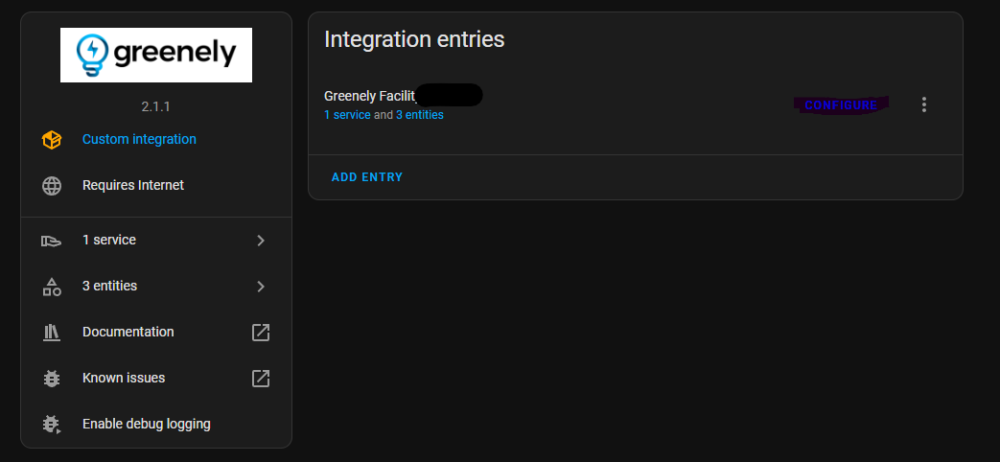
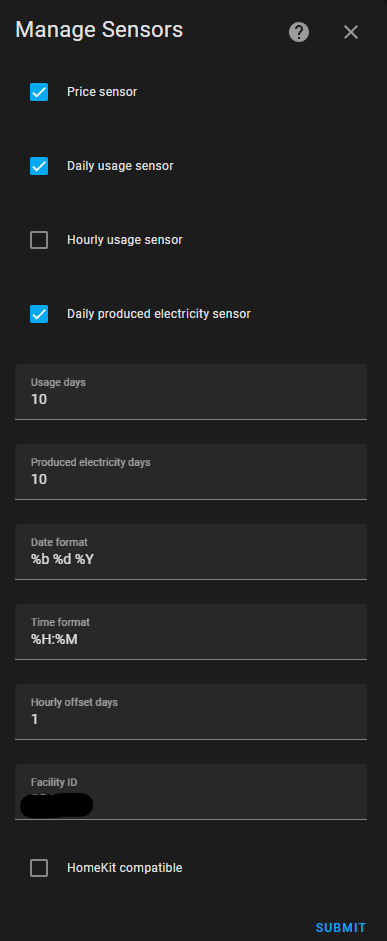

# sensor.greenely

    
[](https://github.com/hacs/integration)

_Custom component to get usage data and prices from [Greenely](https://www.greenely.se/) for [Home Assistant](https://www.home-assistant.io/)._

Because Greenely doesn't have an open api yet, we are using the Android user-agent to access data.
Data is fetched every hour.

## Installation
### HACS (recommended)
- Have [HACS](https://hacs.xyz/docs/setup/download) installed, this will allow you to easily manage and track updates.
- Search for 'Greenely'.
- Click Install below the found integration.
- Configure using the configuration instructions below.
- Restart Home-Assistant.

### Manual
- Copy directory `custom_components/greenely` to your `<config dir>/custom_components` directory.
- Configure with config below.
- Restart Home-Assistant.

## Configuration
Is done using the UI, click Add integration and search for Greenely.
The initial setup needs your Email and Password for the Greenely account, optionally you could specify the Facility ID.

For additional options go to integrations and select Greenely.
Press configure

Options for additional sensors and settings are now displayed.


### Configuration variables
key | type | description
:--- | :--- | :---
**Email (Required)** | string | Your Greenely username.
**Password (Required)** | string | Your Greenely password.
**Facility ID (Optional)** | string | If you have more than one facility and know the facility ID you want data from, put it here.  Note: The facility ids can be fetch using the service call greenely.fetch_factilites, this will output a notification displaying the facilities for your account.

### Options variables
key | type | description
:--- | :--- | :---
**Prices (Optional)** | boolean | Creates a sensor showing price data in kr/kWh. Default `true`.
**Daily usage sensor (Optional)** | boolean | Creates a sensor showing daily usage data. The state of this sensor is yesterday's total usage. Default `true`.
**Hourly usage sensor (Optional)** | boolean | Creates a sensor showing yesterday's hourly usage data. Default `false`.
**Daily produced electricity sensor (Optional)** | boolean | Creates a sensor showing daily produced electricity data. The state of this sensor is the total value. Default `false`.
**Usage days (Optional)** | number | How many days of usage data you want. Default `10`.
**Produced electricity days (Optional)** | number | How many days of produced electricity data you want. Default `10`.
**Date format (Optional)** | string | Default `%b %d %Y`, shows up as `Jan 18 2020`. [References](https://strftime.org/)
**Time format (Optional)** | string | Default `%H:%M`, shows up as `10:00`. [References](https://strftime.org/)
**Hourly offset days (Optional)** | number | How many days ago you want the hourly data from. Default `1` (yesterday's data).
**Homekit compatible (Optional)** | boolean | If you're using Homekit and need the current price data in the format `x.x °C`, enable this. Default `false`.
**Facility ID (Optional)** | string | If you have more than one facility and know the facility ID you want data from, put it here.  Note: The facility ids can be fetch using the service call greenely.fetch_factilites, this will output a notification displaying the facilities for your account.

## Services
**Fetch factilites**
This service will fetch the facilites data and output it into a formated notification displaying the following. ID, Street, Zip code, City and Primary attributes for each of your facilites.

Field | Type | Description
:--- | :--- | :---
**Email (Required)** | string | Your Greenely username.
**Password (Required)** | string | Your Greenely password.
**Output json (Optional)** | boolean | Will output the complete payload from Greenely in json format into an additional notification. Default `false`.

Example without json output:
```yaml
service: greenely.fetch_facilities
data:
  email: user@example.com
  password: password
```

Example with json output:
```yaml
service: greenely.fetch_facilities
data:
  email: user@example.com
  password: password
  output_json: true
```

## Lovelace
**Example chart with [ApexCharts Card](https://github.com/RomRider/apexcharts-card):**
Use these configurations for the sensor
```yaml
hourly_usage: true
date_format: '%Y-%m-%d'
```
```yaml
- type: custom:apexcharts-card
  header:
    title: Förbrukning/timme & elpris
    show: true
  graph_span: 24h
  span:
    start: day
    offset: '-1d'
  yaxis:
    - id: first
      apex_config:
        tickAmount: 10
      min: 0
      max: 2
    - id: second
      opposite: true
      apex_config:
        tickAmount: 5
      min: 0
      decimals: 0
  apex_config:
    dataLabels:
      enabled: false
    stroke:
      width: 4
  series:
    - entity: sensor.greenely_hourly_usage
      name: Förbrukning
      yaxis_id: first
      type: column
      color: red
      show:
        legend_value: false
      data_generator: |
        return entity.attributes.data.map((entry) => {
          return [new Date(entry.localtime), entry.usage];
        }); 
    - entity: sensor.greenely_prices
      data_generator: |
          return entity.attributes.previous_day.map((entry) => {
            return [new Date(entry.date + 'T' + entry.time), entry.price];
          }); 
      yaxis_id: second
      type: line
      color: blue
      name: Elpris
      show:
        legend_value: false
```


**Example usage with [flex-table-card](https://github.com/custom-cards/flex-table-card):**
```yaml
- type: 'custom:flex-table-card'
  title: Greenely Daily Usage
  sort_by: date
  entities:
    include: sensor.greenely_daily_usage
  columns:
    - name: date
      attr_as_list: data
      modify: x.localtime
      icon: mdi:calendar
    - name: kWh
      attr_as_list: data
      modify: x.usage
      icon: mdi:flash
```


**Example prices with [flex-table-card](https://github.com/custom-cards/flex-table-card):**
```yaml
- type: custom:vertical-stack-in-card
  cards:
    - type: horizontal-stack
      cards:
        - type: 'custom:flex-table-card'
          title: Today
          sort_by: date
          entities:
            include: sensor.greenely_prices
          columns:
            - name: time
              attr_as_list: current_day
              modify: x.time
              icon: mdi:clock
            - name: price(öre/kWh)
              attr_as_list: current_day
              modify: Math.round(x.price * 100)
              icon: mdi:cash
        - type: 'custom:flex-table-card'
          title: Tomorrow
          sort_by: date
          entities:
            include: sensor.greenely_prices
          columns:
            - name: time
              attr_as_list: next_day
              modify: x.time
              icon: mdi:clock
            - name: price(öre/kWh)
              attr_as_list: next_day
              modify: Math.round(x.price * 100)
              icon: mdi:cash
```


**Example usage with [Node-Red Companion](https://github.com/zachowj/hass-node-red) and tts**

<details>
  <summary>Clipboard</summary>
  
```[{"id":"3d82b277.52bb3e","type":"subflow","name":"volume adjustment 70%","info":"","category":"","in":[{"x":40,"y":200,"wires":[{"id":"ace99ba9.14ecf8"}]}],"out":[],"env":[]},{"id":"a6b88b50.4af618","type":"api-call-service","z":"3d82b277.52bb3e","name":"Set volume to 70%","server":"78ca140a.63476c","version":1,"debugenabled":false,"service_domain":"media_player","service":"volume_set","entityId":"media_player.google","data":"{\"volume_level\":0.7}","dataType":"json","mergecontext":"","output_location":"payload","output_location_type":"msg","mustacheAltTags":false,"x":530,"y":140,"wires":[[]]},{"id":"bd929e33.12a5a","type":"switch","z":"3d82b277.52bb3e","name":"70% ?","property":"data.attributes.volume_level","propertyType":"msg","rules":[{"t":"neq","v":"0.7","vt":"num"}],"checkall":"true","repair":false,"outputs":1,"x":330,"y":200,"wires":[["a6b88b50.4af618","c810b1a6.ad421"]]},{"id":"c810b1a6.ad421","type":"function","z":"3d82b277.52bb3e","name":"previous volume","func":"msg.payload =\n{\n    \"data\":{\n      \"entity_id\":\"media_player.google\",\n      \"volume_level\": 0.4\n    }\n}\nreturn msg;","outputs":1,"noerr":0,"x":500,"y":200,"wires":[["8876effc.617e4"]]},{"id":"8876effc.617e4","type":"delay","z":"3d82b277.52bb3e","name":"","pauseType":"delay","timeout":"8","timeoutUnits":"seconds","rate":"1","nbRateUnits":"1","rateUnits":"second","randomFirst":"1","randomLast":"5","randomUnits":"seconds","drop":false,"x":700,"y":200,"wires":[["f0ffa361.42bab"]]},{"id":"f0ffa361.42bab","type":"api-call-service","z":"3d82b277.52bb3e","name":"set volume to previous","server":"78ca140a.63476c","version":1,"debugenabled":false,"service_domain":"media_player","service":"volume_set","entityId":"media_player.google","data":"{\"volume_level\":\"{{msg.payload.data.volume_level}}\"}","dataType":"json","mergecontext":"","output_location":"payload","output_location_type":"msg","mustacheAltTags":false,"x":920,"y":200,"wires":[[]]},{"id":"ace99ba9.14ecf8","type":"api-current-state","z":"3d82b277.52bb3e","name":"speaker","server":"78ca140a.63476c","version":1,"outputs":1,"halt_if":"","halt_if_type":"str","halt_if_compare":"is","override_topic":true,"entity_id":"media_player.google","state_type":"str","state_location":"payload","override_payload":"msg","entity_location":"data","override_data":"msg","blockInputOverrides":false,"x":180,"y":200,"wires":[["bd929e33.12a5a"]]},{"id":"bf9a6d11.435ea","type":"api-call-service","z":"816aff66.f144b","name":"tts","server":"78ca140a.63476c","version":1,"debugenabled":false,"service_domain":"tts","service":"google_say","entityId":"media_player.google","data":"","dataType":"jsonata","mergecontext":"","output_location":"payload","output_location_type":"msg","mustacheAltTags":false,"x":872,"y":2829,"wires":[["c692e642.c2ba58"]]},{"id":"584c5e33.b7901","type":"function","z":"816aff66.f144b","name":"get current price","func":"var price = msg.data.attributes.current_price;\nif (price !== undefined) {\n    msg = {payload: {data: {message: \"The current price is \" + Math.round(price * 100) }}};\n} else {\n    msg = {payload: {data: {message: \"Sorry, I was unable to fetch the current price\" }}};\n}\nreturn msg;","outputs":1,"noerr":0,"x":701,"y":2829,"wires":[["bf9a6d11.435ea"]]},{"id":"c692e642.c2ba58","type":"subflow:3d82b277.52bb3e","z":"816aff66.f144b","name":"","x":1170,"y":2840,"wires":[]},{"id":"fb18952.6043c68","type":"api-current-state","z":"816aff66.f144b","name":"","server":"78ca140a.63476c","version":1,"outputs":1,"halt_if":"","halt_if_type":"str","halt_if_compare":"is","override_topic":false,"entity_id":"sensor.greenely_prices","state_type":"str","state_location":"payload","override_payload":"msg","entity_location":"data","override_data":"msg","blockInputOverrides":false,"x":430,"y":2800,"wires":[["584c5e33.b7901"]]},{"id":"1d10e908.28fea7","type":"ha-entity","z":"816aff66.f144b","name":"","server":"78ca140a.63476c","version":1,"debugenabled":false,"outputs":2,"entityType":"switch","config":[{"property":"name","value":"scene_electricity_price"},{"property":"device_class","value":""},{"property":"icon","value":""},{"property":"unit_of_measurement","value":""}],"state":"payload","stateType":"msg","attributes":[],"resend":true,"outputLocation":"","outputLocationType":"none","inputOverride":"allow","outputOnStateChange":false,"outputPayload":"$entity().state ? \"on\": \"off\"","outputPayloadType":"jsonata","x":150,"y":2840,"wires":[["fb18952.6043c68"],[]]},{"id":"78ca140a.63476c","type":"server","z":"","name":"Home Assistant","legacy":false,"addon":false,"rejectUnauthorizedCerts":false,"ha_boolean":"y|yes|true|on|home|open","connectionDelay":true,"cacheJson":true}]\```
  
</details>

You can then for example make a script to trigger it through voice commands to Google Assistant!

## Debug logging
Add this to your configuration.yaml to debug the component
```logger:
  default: warning
  logs:
    custom_components.greenely: debug
```  

## Data object structures
**previous_day, current_day, next_day & current_month**
```json
[{ "date": "Jan 18 2020", "time": "13:00", "price": "24.75" }]
```
**days**
```json
[{ "localtime": "Jan 12 2020", "usage": "11.0" }]
```
**hourly**
```json
[{ "localtime": "Jan 12 2020 10:00", "usage": "1.0" }]
```
**sold_data**
```json
[{ "date": "Jan 12 2020", "usage": "11.0", "is_complete": true }]
```
